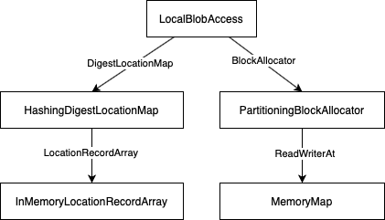
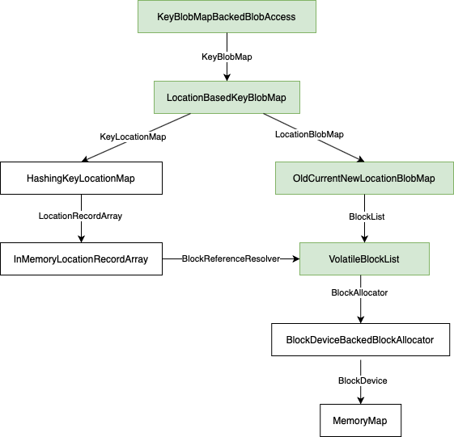
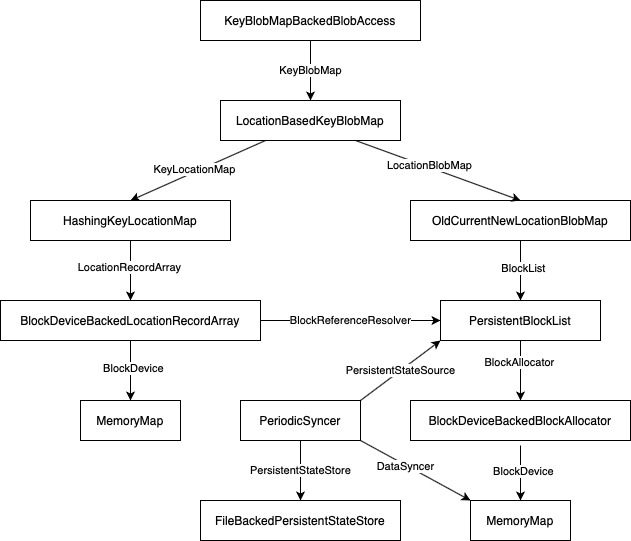

# Buildbarn Architecture Decision Record #5: Persistency for LocalBlobAccess

Author: Ed Schouten<br/>
Date: 2020-09-12

# Context

In addition to all of the storage backends that Buildbarn provides to
access the contents of the Content Addressable Storage (CAS) and Action
Cache (AC) remotely, there are two backends that store data locally:
CircularBlobAccess and LocalBlobAccess. These two storage backends have
various use cases:

- They can be used to build fast centralized storage, especially when
  used in combination with MirroredBlobAccess and ShardingBlobAccess.
  See [ADR #2](0002-storage.md) for more details.
- They can be used to set up local caches when used in combination with
  ReadCachingBlobAccess. Such caches can speed up access to the CAS in a
  given site or on an individual system.

Buildbarn originally shipped with CircularBlobAccess (written in 2018).
As part of the work on ADR #2, LocalBlobAccess was added.
LocalBlobAccess has a couple of advantages over CircularBlobAccess:

- When sized appropriately, it is capable of supporting Bazel's
  [Builds without the Bytes](https://docs.google.com/document/d/11m5AkWjigMgo9wplqB8zTdDcHoMLEFOSH0MdBNCBYOE/edit).
- It doesn't suffer from the data corruption bugs that
  CircularBlobAccess has.
- It can store its data on raw block devices, which tends to be a lot
  faster than using files on a file system. It also ensures that the
  maximum amount of space used is bounded.
- Block devices are memory mapped, making reads of blobs that are
  already loaded from disk nearly instantaneous.
- It supports random offset reads, while CircularBlobAccess can only
  read data sequentially.

There are, however, a couple of disadvantages to using LocalBlobAccess:

- It only supports raw block devices. This can be problematic in case
  Buildbarn is deployed in environments where raw block device access is
  unsupported (e.g., inside unprivileged containers).
- It doesn't persist data across restarts, as the digest-location map,
  the hash table that indexes data, is only stored in memory.

Let's work towards bringing these missing features to LocalBlobAccess,
so that we can finally remove CircularBlobAccess from the tree.

# Supporting file based storage

A naïve way of adding file based storage to LocalBlobAccess is to
provide a new implementation of the BlockAllocator type that is backed
by a filesystem.Directory. Each of the blocks created through the
NewBlock() function could be backed by an individual file. The downside
of this approach is that releasing blocks can now fail, as it's not
guaranteed that we can always successfully delete files on disk.

Instead, let's generalize the code in [bb-storage/pkg/blockdevice](https://pkg.go.dev/github.com/buildbarn/bb-storage/pkg/blockdevice)
to support both raw block devices and fixed-size files. Because we only
care about supporting fixed-size files, we can reuse the existing memory
mapping logic.

More concretely, let's replace MemoryMapBlockDevice() with two separate
NewBlockDeviceFrom{Device,File}() functions, mapping raw block devices
and regular files, respectively. Let's also introduce a generic
configuration message, so that any component in Buildbarn that uses
block devices supports both modes of access.

# Supporting persistency

The first step to add persistency to LocalBlobAccess is to allow the
digest-location map to be backed by a file. To achieve that, we can
import PR [bb-storage#62](https://github.com/buildbarn/bb-storage/pull/62),
which adds a FileBasedLocationRecordArray. While there, we should modify
it to be built on top of bb-storage/pkg/blockdevice, so that it can both
use raw block devices and files. Let's call this type
BlockDeviceBackedLocationRecordArray instead.

Storing the digest-location map on disk isn't sufficient to make
LocalBlobAccess persistent. One crucial piece of information that is
missing is the list of Block objects that LocalBlobAccess extracted from
the underlying BlockAllocator, and the write cursors that
LocalBlobAccess tracks for them. PR [bb-storage#63](https://github.com/buildbarn/bb-storage/pull/63)
attempted to solve this by letting LocalBlobAccess write this state into
a text file, so that it can be reloaded on startup.

The main concern with this approach is that it increases the complexity
of LocalBlobAccess, while that class is already bigger than it should
be. It is hard to get decent unit testing coverage of LocalBlobAccess,
and this change would make that even harder. Let's solve this by moving
the bottom half that is responsible for managing Block objects and write
cursors from LocalBlobAccess into a separate interface, called
BlockList:

```go
type BlockList interface {
        // Managing the blocks in the list.
        PopFront()
        PushBack() error
        // Reading data from blocks.
        Get(blockIndex int, ...) buffer.Buffer
        // Writing data to blocks.
        HasSpace(blockIndex int, sizeBytes int64) bool
        Put(blockIndex int, sizeBytes int64) BlockListPutWriter
}
```

For non-persistent workloads, we can add a basic implementation called
VolatileBlockList that maintains the existing behaviour. For persistent
workloads, we can provide a more complex implementation named
PersistentBlockList.

With the changes in PR bb-storage#63 applied, LocalBlobAccess writes a
text file to disk every time data is stored. First of all, we should
consider using a Protobuf for this, as this makes it easier to add
structure and extend the format where needed. Second, we should only
emit the state file periodically and asynchronously, so that I/O and
lock contention remain minimal. Let's solve this by adding the following
two interfaces:

```go
// This interface needs to be implemented by PersistentBlockList, so
// that its layout can be extracted.
type PersistentStateSource interface {
        // Returns a channel on which the caller can wait for writes to
        // occur. This ensures that system can remain fully idle if no
        // I/O takes place.
        GetBlockPutWakeup() <-chan struct{}
        // Returns the current layout of the PersistentBlockList.
        GetPersistentState() *pb.PersistentState
        ...
}

// An implementation of this interface could, for example, write the
// Protobuf message to a file on disk.
type PersistentStateStore interface {
        WritePersistentState(persistentState *pb.PersistentState) error
}
```

A PeriodicSyncer helper type can provide a run loop that takes data from
PersistentStateSource and passes it to PersistentStateStore.

# Persistency with data integrity

With the changes proposed above, we provide persistency, but don't
guarantee integrity of data in case of unclean system shutdowns. Data
corruption can happen when digest-location map entries are flushed to
disk before all of the data corresponding to the blob is. This may be
acceptable when LocalBlobAccess is used to hold the CAS (because of
checksum validation), but for the AC it could cause us to interpret
invalid Protobuf data.

One way to solve this issue is to call `fsync()` (or Linux's own
`sync_file_range()`) between writes of data and digest-location map
insertions, but doing so will decimate performance. To prevent the need
for that, we can let a background job (i.e., the PeriodicSyncer that was
described previously) call `fsync()` periodically. By incrementing a
counter value before every `fsync()` call, and embedding its value into
both digest-location map entries and the state file, we can accurately
track which entries are valid and which ones potentially point to
corrupted data. Let's call this counter the 'epoch ID'. References to
blocks in digest-location map entries can now be expressed as follows:

```go
type BlockReference struct {
        EpochID        uint32
        // To be subtracted from the index of the last block used at the
        // provided epoch.
        BlocksFromLast uint16
}
```

One issue with this approach is that once restarts take place and
execution continues at the last persisted epoch ID, the digest-location
map may still contain entries for future epoch IDs. These would need to
be removed, as they would otherwise cause (potentially) corrupted blobs
to become visible again by the time the epoch ID equals the value stored
in the digest-location map entry.

Removing these entries could be done explicitly by scrubbing the
key-location map during startup. The disadvantage is that this
introduces a startup delay, whose duration is proportional to the size
of the digest-location map. For larger setups where the digest-location
map is tens of gigabytes in size, this is unacceptable. We should
therefore aim to design a solution that doesn't require any scrubbing.

To prevent the need for scrubbing, we can associate every epoch ID with
a random number, and enforce that entries in the digest-location map are
based on the same value. This makes it possible to distinguish valid
entries from ones that were written prior to unclean system shutdown.
Instead of storing this value literally as part of digest-location map
entries, it could be used as a seed for a record checksum. This has the
advantage of hardening the digest-location map against silent data
corruption (e.g., bit flips).

An approach like this does require us to store all these 'hash seeds'
for every epoch with one or more valid blocks as part of the persistent
state file. Fortunately, the number of epochs can only grow relatively
slowly. If LocalBlobAccess is configured to synchronize data to disk
once every minute and at least some writes take place every minute,
there will still only be 526k epochs in one year. This number can only
be reached if not a single block rotation were to happen during this
timeframe, which is extremely unlikely. There is therefore no need to
put a limit on the maximum number of epochs for the time being.

Higher levels of LocalBlobAccess code will not be able to operate on
BlockReferences directly. Logic in both HashingDigestLocationMap and
LocalBlobAccess depend on being able to compare block numbers along a
total order. This is why we should make sure that BlockReference is only
used at the storage level, namely inside LocationRecordArray
implementations. To allow these types to look up hash seeds and convert
BlockReferences to integer block indices, we can add the following
helper type:

```go
type BlockReferenceResolver interface {
        BlockReferenceToBlockIndex(blockReference BlockReference) (int, uint64, bool)
        BlockIndexToBlockReference(blockIndex int) (BlockReference, uint64)
}
```

By letting BlockReferenceToBlockIndex() return a boolean value
indicating whether the BlockReference is still valid, we can remove the
existing LocationValidator type, which served a similar purpose.

One thing that the solution above still lacks, is that there is no
feedback mechanism between PeriodicSyncer and PersistentBlockList. If
PeriodicSyncer can't keep up with the changes made to the
PersistentBlockList, there is a chance that PersistentBlockList starts
to recycle blocks that are still referenced by older epochs that are
listed in the persistent state file. This could also cause data
corruption after a restart.

To address this, PersistentBlockList's PushBack() should be made to fail
explicitly when blocks are recycled too quickly. To reduce the
probability of running into this situation, PersistentBlocklist should
offer a GetBlockReleaseWakeup() that allows PeriodicSyncer to update the
persistent state file without any delay. A
NotifyPersistentStateWritten() method should be added to allow
PeriodicSyncer to notify the PersistentBlockList that it's safe to
recycle blocks that were removed as part of the previous
GetPersistentState() call.

# Refactoring

While we're making these drastic changes to LocalBlobAccess, let's spend
some effort to make further cleanups:

- With the addition of CompactDigest, almost all code of LocalBlobAccess
  has been turned into to a generic key-value store. It no longer assumes
  keys are REv2 digests. Let's rename CompactDigest to Key, and
  DigestLocationMap to KeyLocationMap.

- LocalBlobAccess can be decomposed even further. All of the code that
  implements the "old" vs. "current" vs. "new" block distinction
  effectively provides a location-to-blob map. Let's move all of this
  behind a LocationBlobMap interface, similar to how we have
  KeyLocationMap.

- All of the code in LocalBlobAccess that ties the KeyLocationMap to a
  LocationBlobMap can easily be moved into its own helper type. Let's
  move that code behind a KeyBlobMap interface, as it simply provides a
  mapping from a Key to a blob.

- What remains in LocalBlobAccess isn't much more than an implementation
  of BlobAccess that converts REv2 digests to Keys before calling into
  KeyBlobMap. The name LocalBlobAccess now makes little sense, as there
  is no requirement that data is stored locally. Let's rename this type
  to KeyBlobMapBackedBlobAccess.

- Now that we have a BlockDeviceBackedLocationRecordArray, let's rename
  PartitioningBlockAllocator to BlockDeviceBackedBlockAllocator for
  consistency.

- The handles returned by bb-storage/pkg/blockdevice now need to provide
  a Sync() function to flush data to storage. The existing handle type
  is named ReadWriterAt, which is a poor fit for an interface that also
  provides a Sync() function. Let's rename this to BlockDevice.

With all of these changes made, it should be a lot easier to achieve
decent unit testing coverage of the code.

# Architectural diagram of the old and new LocalBlobAccess

LocalBlobAccess before the proposed changes are made:

<p align="center">
  
</p>

LocalBlobAccess after the proposed changes are made, but with
persistency still disabled:

<p align="center">
  
</p>

The classes colored in green perform a similar role to the old
LocalBlobAccess type that they replace.

LocalBlobAccess after the proposed changes are made, but with
persistency enabled:

<p align="center">
  
</p>

Note that these are not UML class diagrams. The arrows in these diagrams
indicate how objects reference each other. The labels on the arrows
correspond with the interface type that is used.

# Thanks

The author would like to thank Tom Coldrick from Codethink Ltd. for his
contributions. His PRs gave good insight in what was needed to add
persistency.

# Future work

With bb-storage/pkg/blockdevice generalized to support file storage,
there is no longer any need to keep bb-remote-execution's
DirectoryBackedFilePool, as BlockDeviceBackedFilePool can be used in its
place. We should consider removing DirectoryBackedFilePool.

Letting the key-location map be backed by a disk may increase access
latency significantly. Should we add a configuration option for calling
`mlock()` on the memory map, so that its contents are guaranteed to
remain in memory?
