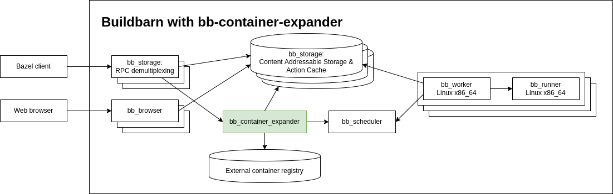

# Buildbarn Architecture Decision Record #8: Container image expansion

(c) Copyright 2022, Zenseact AB. All rights reserved.

Author: Fredrik Medley 
Date: 2022-04-21

# Context

When running remote execution, the clients are usually not providing all the files as inputs. Instead, it is assumed that the action is run in a specific environment. The defacto standard is to specify a container image as part of [the `platform` field](https://github.com/bazelbuild/remote-apis/blob/2af1c432ce11b01e46cf70d7933f71a3310282d6/build/bazel/remote/execution/v2/remote_execution.proto#L520) of the action, using the key `container-image`.

The problem comes to the split of responsibility where the client specifies the wanted container image and the server needs to prepare runners with that container image. In the general case, the server side cannot predict all different container images the clients would like to use.

# Proposed change

In this ADR we propose to add a new `bb-container-expander` service, in front of the `bb-scheduler`. For each specified `container-image` (yes, the protocol accepts multiple entries) among the platform properties, the [input Merkle tree](https://github.com/bazelbuild/remote-apis/blob/2af1c432ce11b01e46cf70d7933f71a3310282d6/build/bazel/remote/execution/v2/remote_execution.proto#L468) will be extended. The resulting action will not specify any `container-image` at all. The worker will also have to employ [`chroot`](https://github.com/buildbarn/bb-remote-execution/blob/c4bbd24a8d272267f40b234533f62c8ccf24d568/pkg/proto/configuration/bb_runner/bb_runner.proto#L36-L39) when executing the actions, optionally moving the original input tree into a specific directory.

  

The input tree might become very big. This might lead to long times to hard link files to the runner from the worker cache. This can be mitigated by using the FUSE option for the runner build directory.

The process of expanding a container image will be to:
1. Download the metadata for the image.
1. For each layer, download the layer and upload it as a Merkle tree to the content addressable storage (CAS).
1. Merge Merkle trees for each layer in order.

Each step will be cached in the action cache (AC), using a "fake" action. It can look like setting the command line as `- bb-container-expander download-metadata ...` which should not collide with any actions provided by the client.

Assuming that the container image files and the client provided inputs are generally located in different directories, most of the Merkle tree merging will happen close to the root level and therefore not consume much resources. Merging the layers will go deeper in the structures, so a local AC and Merkle tree cache (CAS) is probably necessary.

# Other considered solutions

If the set of container images to be used is given, autoscaling in Kubernetes can be used to scale certain images up and others down, depending on the load. This helps to keep the locality of the files, where all actions using the same image will be scheduled on the same runners.

To support dynamic images, another service would have to listen to the scheduler for operations that do not have any matching runner and quickly spawn such runners.

This solution was not chosen as it gets limited to Kubernetes, it doesn't work in docker-compose or on a bare deployment. It might also need to be tailored for different Kubernetes suppliers, adding maintenance work.
